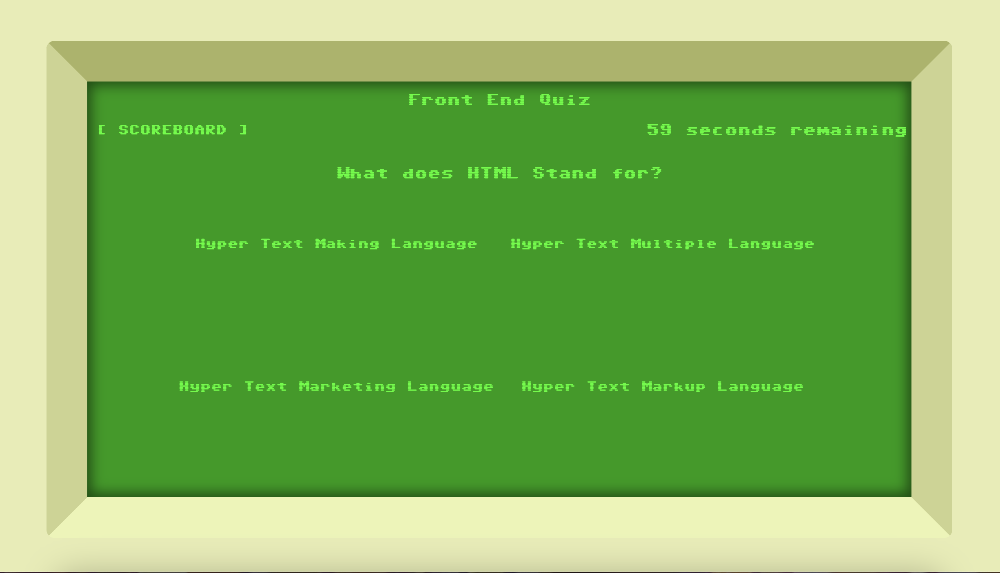

# Front End Quiz

This application is a simple quiz game implemented in JavaScript, HTML, and CSS. It allows users to answer multiple-choice questions within a time limit and keeps track of their scores. Below is a brief overview of the application and its functionalities.

# Features
Scoreboard Button System: Clicking on the "Scoreboard" button toggles the display of the scoreboard.

Timer: The game has a countdown timer set to 60 seconds. Users must answer questions within this time limit.

Question Display: Questions are displayed one at a time with four multiple-choice options.

Answer Validation: Users select an answer by clicking on the corresponding button. The application validates the answer and updates the score accordingly.

End of Quiz: Once all questions are answered or the timer runs out, the quiz ends, and the user's score is displayed.

Score Input: After the quiz ends, users can input their name and store their score in the scoreboard.

# Usage
Click the "Start" button to begin the quiz.

Read each question carefully and select the correct answer by clicking the corresponding button.

If the answer is correct, your score increases. If incorrect, time decreases by 5 seconds.

Repeat this process for all questions until the quiz ends.

After the quiz ends, input your name and click the "Submit" button to store your score in the scoreboard.

You can toggle the display of the scoreboard by clicking the "Scoreboard" button.

# Code Overview
scoreboardToggle(): Function to toggle the display of the scoreboard.

displayQuestion(): Function to display the current question and choices.

checkAnswer(event): Function to validate the selected answer and update the score.

endQuiz(): Function to end the quiz and display the score input section.

scoreStore(): Function to store the user's score in the scoreboard.

# Dependencies
This application does not have any external dependencies. It runs purely on client-side JavaScript.

# Note
This README assumes basic knowledge of HTML, CSS, and JavaScript.

# Author
This application was developed by Ezra Rogers.

# License
This project is licensed under the MIT License.